<h1 align="center">基于SpringBoot+Vue的问卷调查系统系统【带论文】</h1>

- <b>完整代码获取地址：从戎源码网 ([https://armycodes.com/](https://armycodes.com/))</b>
- <b>技术探讨、资料分享，请加QQ群：692619798</b>
- <b>作者微信：19941326836  QQ：3645296857</b>
- <b>承接计算机毕业设计、Java毕业设计、Python毕业设计、深度学习、机器学习</b>
- <b>选题+开题报告+任务书+程序定制+安装调试+论文+答辩ppt 一条龙服务</b>
- <b>所有选题地址 ([https://github.com/Descartes007/allProject](https://github.com/Descartes007/allProject)) </b>

## 一、项目介绍

### 基于SpringBoot+Vue的问卷调查系统，系统角色为管理员与普通用户（用户），主要功能如下
### 管理员：
- 基本操作：登录、修改密码、获取个人信息、修改个人信息、退出登录
### 系统设置管理：查看系统信息、编辑系统配置、维护首页展示
### 新闻信息管理：发布新闻、编辑新闻、删除新闻、查看新闻详情、搜索新闻
### 试卷管理：新增试卷、编辑试卷、删除试卷、发布/下架、查看试卷详情
### 试题管理：新增试题、导入/导出试题、编辑试题、删除试题、按类型筛选
- 考试记录管理：查看考试记录、筛选记录、删除记录、查看成绩详情
- 答题明细管理：查看答题详情、按试卷/用户筛选、删除明细
### 前台用户管理：新增用户、编辑用户、重置密码、删除用户、查看用户详情
### 管理员账户管理：新增管理员、编辑资料、重置密码、删除管理员
### 普通用户（用户）：
- 基本操作：注册/登录、修改密码、获取个人信息、修改个人信息
- 新闻浏览：查看新闻列表、搜索新闻、查看新闻详情
- 试卷与考试：查看试卷列表、按类型筛选、参加考试、交卷
- 试题作答：在线作答、切换题目、提交答案
- 成绩与记录：查看考试成绩、查看个人考试记录、查看答题明细

## 二、项目技术

- 编程语言：Java
- 项目架构：B/S架构
- 前端技术：Vue 2.x、Element UI、Axios、Vue Router、Vue-Quill-Editor
- 后端技术：Spring Boot、MyBatis-Plus、MyBatis、MySQL、Fastjson、Hutool

## 三、运行环境

- JDK版本：1.8及以上都可以
- 操作系统：Windows7/10、MacOS
- 开发工具：IDEA、Ecplise、MyEclipse都可以

## 四、数据库配置文件

- npm版本：6.14.13及以上都可以
- Redis版本：3.2.100及以上都可以
- 文件名：application.yml
- 编码类型：utf8

## 论文截图

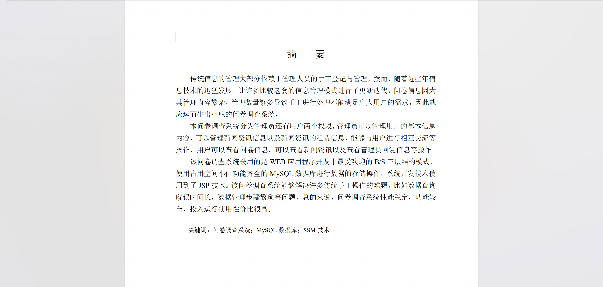

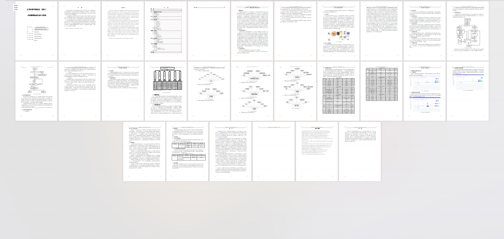

## 系统截图

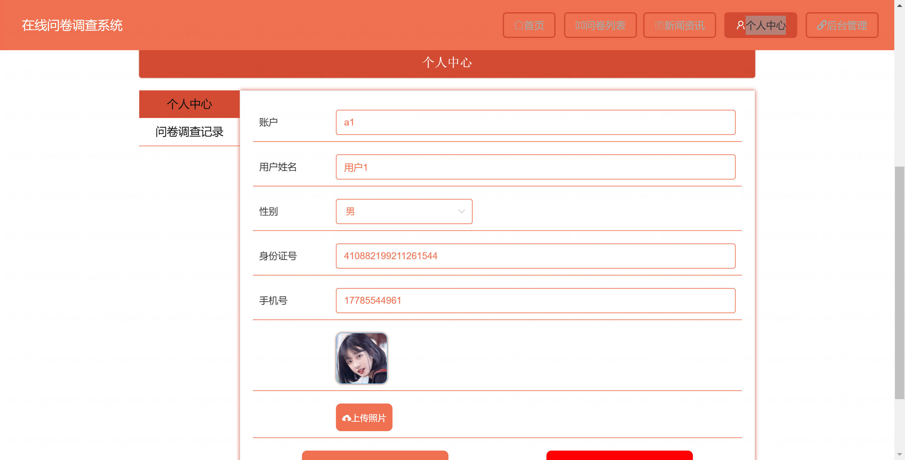

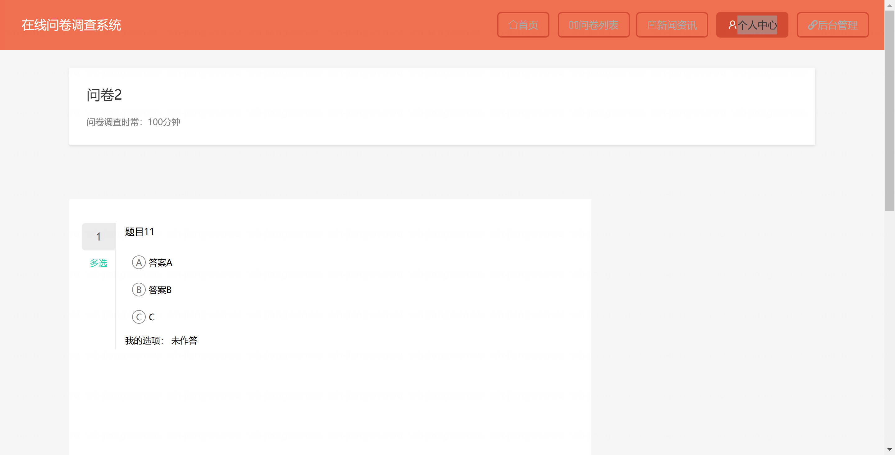

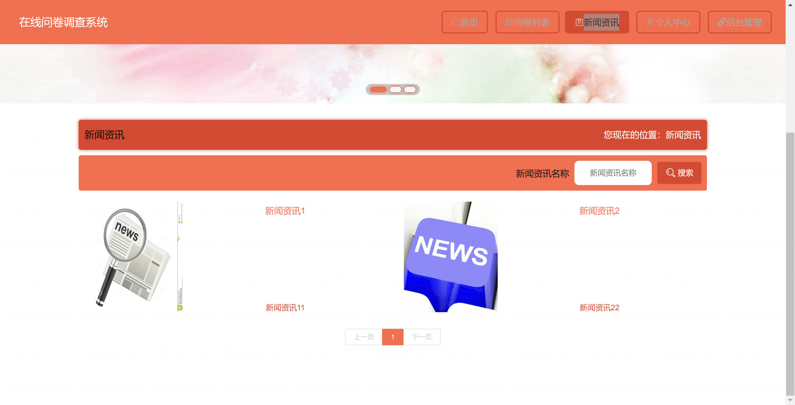

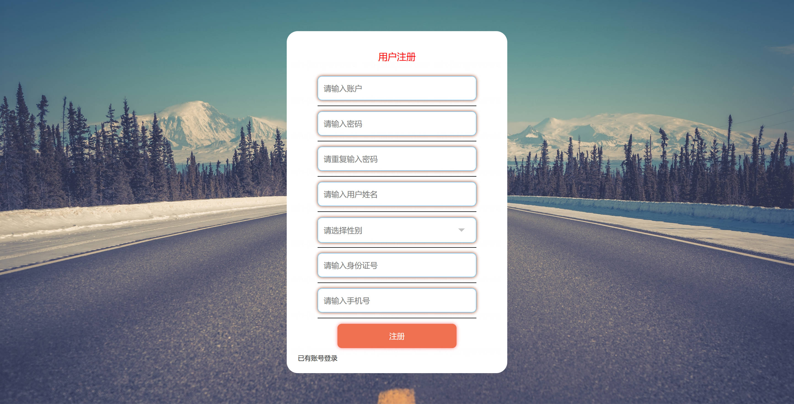

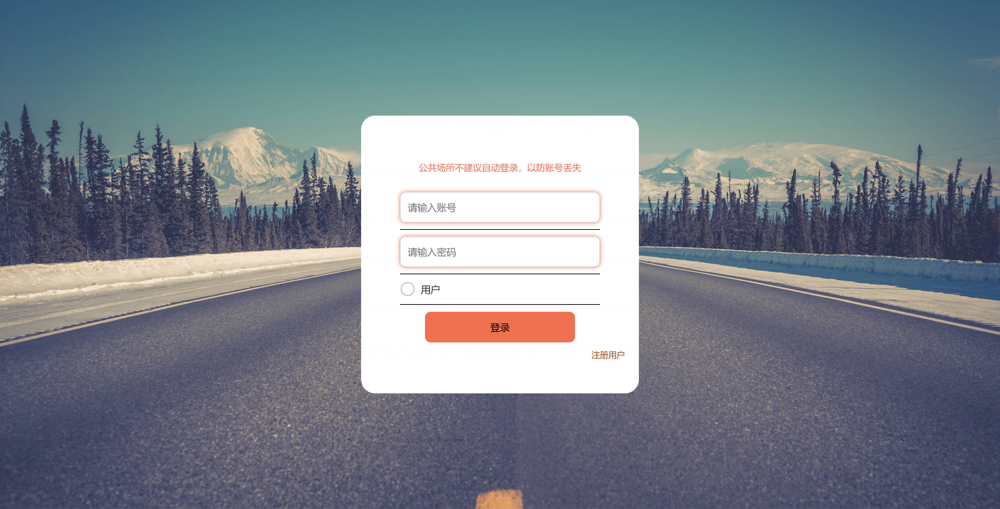

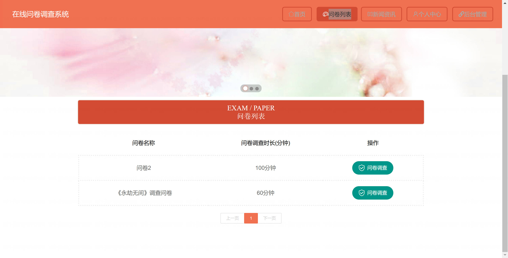

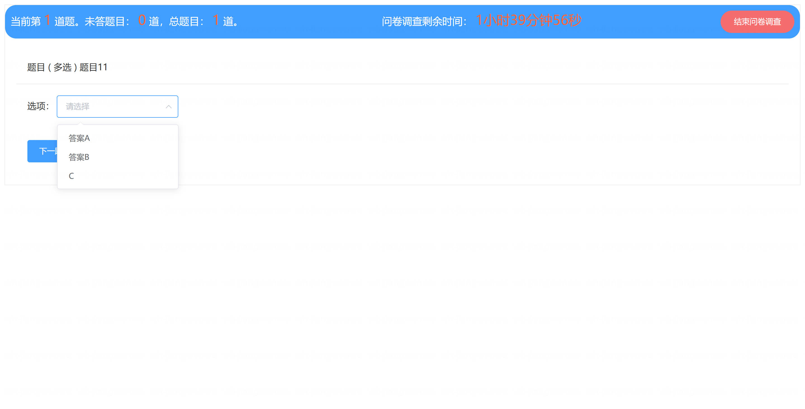

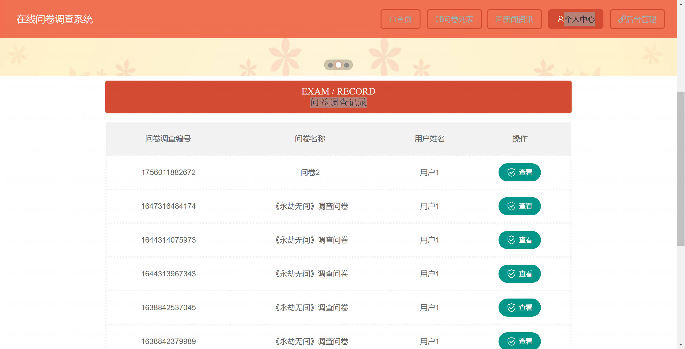

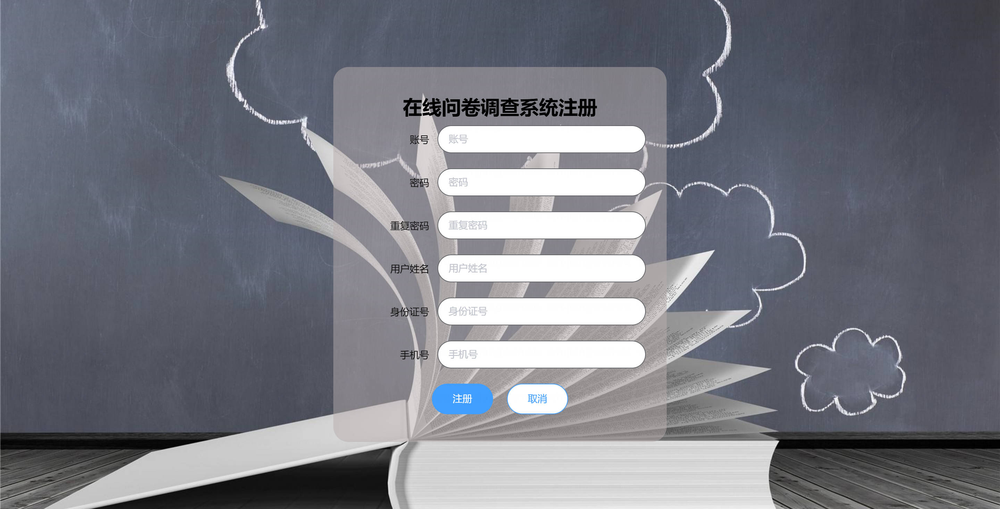

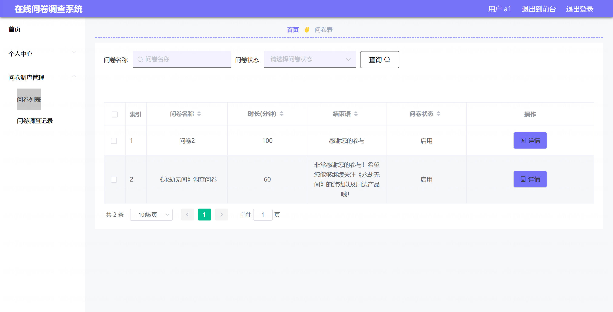